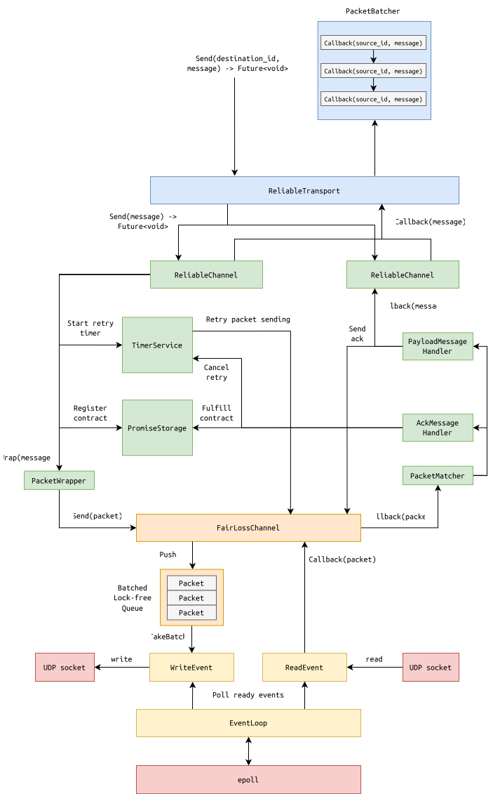

# BroadcastService
Library with broadcast primitives for building distrbuted systems.

[](https://github.com/NikitaEvs/BroadcastService/actions/workflows/test.yml)
---

# Overview
This is an educational project to implement different building blocks for distrbuted systems with focus on performance.

Implemented abstractions include:
- [Perfect Links](include/applications/perfect_links.hpp). Reliable transport over UDP with eventual delivery guarantee.
- [Uniform Reliable Broadcast](include/primitives/uniform_reliable_broadcast.hpp). Broadcast primitive that ensures that the message is either delivered by all processes or by none.
- [FIFO Broadcast](include/applications/fifo.hpp). Broadcast primitive that additionaly ensures that the messages are delivered in the same order as broadcasted.
- [Lattice Agreement](include/applications/lattice_agreement.hpp). Weaker [form](https://link.springer.com/article/10.1007/BF02242714) of a consensus protocol where processes decide on sets of values.

# Usage 

## Requirements
- cmake 3.9 or higher
- gcc or clang (tested on gcc 11.4 and clang 15)

## How to build
```bash
mkdir build
cd build
cmake -DCMAKE_BUILD_TYPE=<cmake-build-type> -DASAN=<ON/OFF> -DTSAN=<ON/OFF> -DUNIT_TESTS=<ON/OFF> ..
make
```
Where the following should be filled:
- `CMAKE_BUILD_TYPE`: [build type](https://cmake.org/cmake/help/latest/variable/CMAKE_BUILD_TYPE.html) of generators.
- `ASAN`: whether [Address Sanitizer](https://clang.llvm.org/docs/AddressSanitizer.html) is enabled.
- `TSAN`: whether [Thread Sanitizer](https://clang.llvm.org/docs/ThreadSanitizer.html) is enabled.
- `UNIT_TESTS`: whether build of unit tests is enabled.

## How to run
The library can be used indepentently or within a test application to showcase functionality. Use the [run script](tools/run.sh) to run the example application on the node:
```bash
cd tools
./run.sh --id <node-id> --hosts <host-file> --output <output-results-file> <config> <mode> 
```
Where the following should be filled:
- `node-id`: ID of the current node.
- `host-file`: file with hosts configuration.
- `output-results-file`: path to the output file.
- `config`: path to the config file.
- `mode`: example application mode (PERFECT_LINKS/FIFO/LATTICE). 

Provied examples configs in `tools/` can be used to run the examples:
- Perfect Links
```bash
# Run in terminal 1
/run.sh --id 1 --hosts perfect_links_example_config/hosts --output perfect_links_example_config/output/1.txt perfect_links_example_config/config PERFECT_LINKS
# Run in terminal 2
/run.sh --id 2 --hosts perfect_links_example_config/hosts --output perfect_links_example_config/output/1.txt perfect_links_example_config/config PERFECT_LINKS
# Note: the second application won't stop by itself
```
- FIFO
```bash
# Run in terminal 1
./run.sh --id 1 --hosts fifo_example_config/hosts --output fifo_example_config/output/1.txt fifo_example_config/config FIFO
# Run in terminal 2
./run.sh --id 2 --hosts fifo_example_config/hosts --output fifo_example_config/output/2.txt fifo_example_config/config FIFO
# Run in terminal 3
./run.sh --id 3 --hosts fifo_example_config/hosts --output fifo_example_config/output/3.txt fifo_example_config/config FIFO
# Note: all applications won't stop by themselves 
```
- Lattice Agreement
```bash
# Run in terminal 1
./run.sh --id 1 --hosts lattice_agreement_example_config/hosts --output lattice_agreement_example_config/output/1.txt lattice_agreement_example_config/config_1 LATTICE
# Run in terminal 2
./run.sh --id 2 --hosts lattice_agreement_example_config/hosts --output lattice_agreement_example_config/output/2.txt lattice_agreement_example_config/config_2 LATTICE
# Run in terminal 3
./run.sh --id 3 --hosts lattice_agreement_example_config/hosts --output lattice_agreement_example_config/output/1.txt lattice_agreement_example_config/config_3 LATTICE
# Note: all applications won't stop by themselves 
```

### Host file format
Host file describes the configartion of the system. Each node has a user-defined ID in the format of 1 byte number, IP address and port.
```
node-id-1 ip-address-1 ip-port-1
node-id-2 ip-address-2 ip-port-2
...
```

### Config format
Configuration file format depends on the application mode:
- `PERFECT_LINKS`: The config file contains two integers `m i` in its first line. The integers are separated by a single space character. `m` defines how many messages each sender process should send. `i` is the index of the receiver process. The receiver process only receives messages while the sender processes only send messages. All `n-1` sender processes, send `m` messages each. Sender processes send messages `1` to `m` in order.
- `FIFO`: The config file contains an integer `m` in its first line. `m` defines how many messages each process should broadcast. Processes broadcast messages `1` to `m` in order.
- `LATTICE`: The config file consists of multiple lines. The first line contains three integers, `p vs ds` (separated by single spaces). `p` denotes the number of proposals for each process, `vs` denotes the maximum number of elements in a proposal, and `ds` denotes the maximum number of distinct elements across all proposals of all processes.
The subsequent `p` lines contain proposals. Each proposal is a set of positive integers, written as a list of integers separated by single spaces. Every line can have up to `vs` integers.

## Output file format
Output file contains data which depend on the application:
- `PERFECT_LINKS`: The output file contains a log of send/receive events. Each event is represented by one line of the output file, terminated by a Unix-style line break `\n`. There are two types of events to be logged: 
  - sending of an application message, using the format `b seq_nr`, where `seq_nr` is the sequence number of the message. These messages are numbered sequentially at each process, starting from `1`. 
  - delivery of an application message, using the format `d sender seq_nr`, where `sender` is the id of the process that sent the message and `seq_nr` is the sequence number of the message (as numbered by the sending process).
- `FIFO`: The output file contains a log of broadcast/deliver events. Each event is represented by one line of the output file, terminated by a Unix-style line break `\n`. There are two types of events to be logged: 
  - broadcast of an application message, using the format `b seq_nr`, where `seq_nr` is the sequence number of the message. These messages are numbered sequentially at each process, starting from 1. 
  - delivery of an application message, using the format `d sender seq_nr`, where `sender` is the number of the process that broadcast the message and `seq_nr` is the sequence number of the message (as numbered by the broadcasting process).
- `LATTICE`: The text file contains a log of decisions. Each decision is represented by one line of the output file, by a Unix-style line break `\n`. Given that proposals are set of integers, so are decisions. Thus, a decision should contain a list of integers separated by single spaces (and terminated by a Unix-style line break `\n`). The order of the lines in the output file must be the same as the order of the lines (proposals) in the config file.

## How to test
Run all tests with all possible build combinations with gcc and clang:
```bash
cd build
./tests.sh
```

## Example application descriptions
There are 3 example applications:
- **Perfect Links**. In this application, a set of processes exchange messages using perfect links. In particular a single process only receives messages while the rest of processes only send messages. The communication of every sender with the receiver is realized using the perfect links abstraction.
- **FIFO Broadcast**. Informally, every process is both broadcasting and delivering messages from every other process (including itself) with ordering guarantees. FIFO broadcast is implemented on top of Uniform Reliable Broadcast (URB).
- **Lattice Agreement**. Lattice Agreement is strictly weaker than consensus, as it can be solved in the asynchronous model. In a nutshell, processes propose sets of values and also decide set on a sequence of proposals. In other words, in multi-shot lattice agreement, processes run single-shot lattice agreement on a series of slots. The main property states that (1) the decided set must include the proposal set, and (2) the decided set includes the
proposals of other processes (i.e., the decided set cannot include values which were not proposed).

# Technical Details
## Implemented features
- User-space context switch with both ASAN and TSAN support.
- Stackful co-routines (fibers) with synchronization primitives (OneShotEvent, Mutex, WaitGroup).
- Futures with functional combinators.
- IO event loop over epoll with multithreading support.
- Event-based message channel with binary serialization over UDP.
- [Established-over-unconnected](https://blog.cloudflare.com/everything-you-ever-wanted-to-know-about-udp-sockets-but-were-afraid-to-ask-part-1) socket technique for UDP. 
- Reliable message channel with exponential backoff and rate limiters.
- Scalable timer service using the [timing wheel schema](http://www.cs.columbia.edu/~nahum/w6998/papers/sosp87-timing-wheels.pdf).
- Instrumentation (logger, statistics).

## Implemented distrbuted algorithms primitives
- Best effort broadcast.
- FIFO broadcast.
- Uniform reliable broadcast.
- [Lattice agreement](https://link.springer.com/article/10.1007/BF02242714).

## Message exchange design 
The message exchange component is the most performance-critical. It's implemented as a reliable transport (with retries) over UDP. 

The architecture of the message exchange service is on the following picture:


The whole design consists of 5 layers:
- `ReliableTransport` allows to send a message with eventual delivery guarantees and wait for the delivery on the `Future` (or combine it with functional combinators).
- `ReliableChannel` encapsulates retry logic, delivery contract logic and handling different internal types of messages (acknowledgement type, payload type).
- `FairLossChannel` provides a middle layer between high-level logic and operating system level (UDP socket, epoll). It controls the rate of sending UDP packets and registers async read/write events in the event loop. 
- `EventLoop` handles events execution via epoll.

The whole sending message flow consists of the following steps:

1. User sends a `message` to `destination_id` of the peer via `ReliableTransport` and gets a `Future` of contract of the delivery event.
1. `ReliableTransport` routes the `message` to the corresponding `ReliableChannel` with `destination_id`.
1. `ReliableChannel` starts a retry timer in the `TimerService` and registers a new contract in the `PromiseStorage`. It wraps the message into a packet and send it via `FairLossChannel`. Then it returns the corresponding `Future` to the caller.
1. `FairLossChannel` pushes the packet into `Batched Lock-Free Queue` that limits the speed of sending packets and batches requests together. `FairLossChannel` also registers `WriteEvent` and `ReadEvent` of the corresponding socket in the `EventLoop`, so that it will send packets in a non-blocking way. 
1. Every connected peer has a connected UDP socket over the unconnected one. This technique allows to save on address lookup for every requests after the first one. 
1. When the peer's socket is ready, some amount of requests are taken from the `Batched Queue` and sent to the UDP socket until it will be blocked. Unsent requests are put into the queue again. 

Receiving message flow has the following steps:
1. `FairLossChannel` registers `ReadEvent` on the peer's socket.
1. When the socket is ready, the packet is fetched from it and the `FairLossChannel` delivery callback is called.
1. In the callback, the packet's header is deserialized and the `PacketMatcher` routes the packet to the corresponding callback.
1. If the packet contains user's data, the acknowledgment message is sent using `FairLossChannel` (note that this message won't be retried in the case of loss) and the `ReliablaChannel` delivery callback is called.
1. If the packet is an acknowledgement on the another message, the contract in the `PromiseStorage` is fulfilled and the corresponding retry in the `TimerService` is cancelled.
1. On receiving the message, `ReliableChannel` routes it back with the sender id. Since we are using the connected UDP socket technique, the sender will be known by the kernel demultiplexing to the right socket.
1. On receiving the message, `ReliableTransport` puts the message callback execution into the `PacketBatcher`. It is an asynchronous mutex that serializes callbacks and executes them in batches on some worker in the `ThreadPool`. It allows us not to use any synchronization in the callbacks and move computation to data but not data to computation.